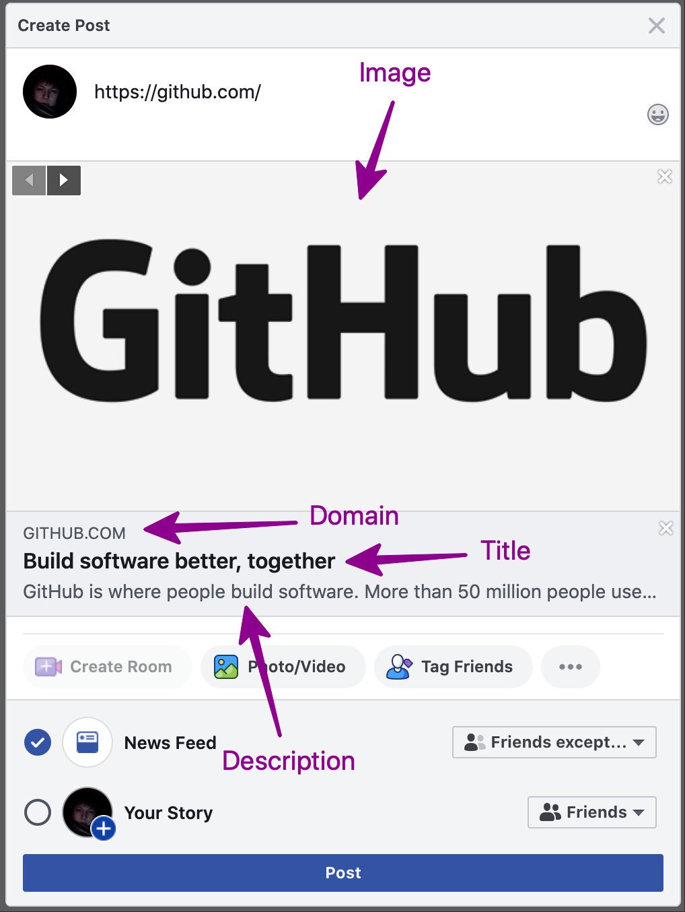

# Microservice for snippet creation
[](https://github.com/psf/black)
[](https://timothycrosley.github.io/isort/)

This microservice intended to consume url and return json with snippet metadata (see picture for more details). Also it provides image width and height (exact answer structure will be available later).<br>
Lets say you are building chat application, social network, or just plain old comment system. You will need some service, that fetch metadata from urls for json for snippet creation. This service provide this functionality.

Example snippet (this illustrates what are we talking about):<br>
<a href="./doc/preview.png"></a>

Quickstart
===
### Docker alone
* `cp .env.dist .env`
* change environment variables in `.env` to desired state (check values lower)
* run service like this:
    ```bash
    docker run\
    --env-file .env micro-snippet-maker\
    -v /srv/host_storage/:/srv/storage/\
    microservice-snippet:latest\
    bin/app/run.sh
    ```

How to use service
===
If you run stock service, you need to use it somehow. This section describes

### Usual sync REST service
* Send request `/?source_url=<desired url>`;
* Get answer with json with desired metadata. Answer will be available after some period of time (while service is goind to source_url and parse data, time depends on various factors: network, source_url speed and many other things).

### Wannabe async service (periodical check flow)
* Setup some settings (via env variable — will be announced later):
    * desired flow;
    * storage (default storage is no storage);
* Send request `/?source_url=<desired url>`;
* Get answer immediately;
* Then loop:
    1. Wait some time (as you deside);
    1. Fetch `/?source_url=<desired url>` again;
    1. If answer is empty, return to first loop step, else desired result is provided. Plus you will need timeout.

### Async scenario (callback flow)
* Setup some settings (via env variable — will be announced later):
    * desired flow;
* Send request `/?source_url=<desired url>`;
* Get answer immediately;
* Wait answer on some url OR in MQ.

Extend
===
TODO

Environment variables
===
* `SNIPPET_WORKERS` — desired number of uvicorn + fastapi workers;
* `SNIPPET_HTML_PARSER` — backend for extraction of meta tags;
* `SNIPPET_STORAGE` — backend for storaging meta tags data.
